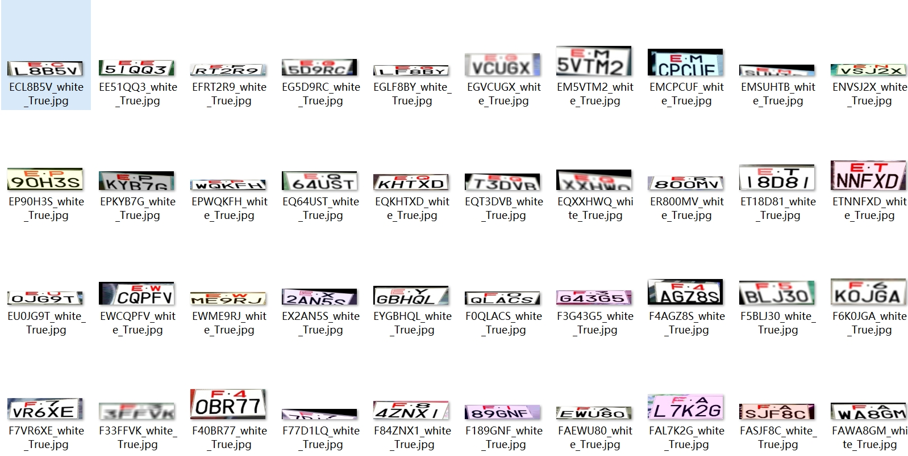
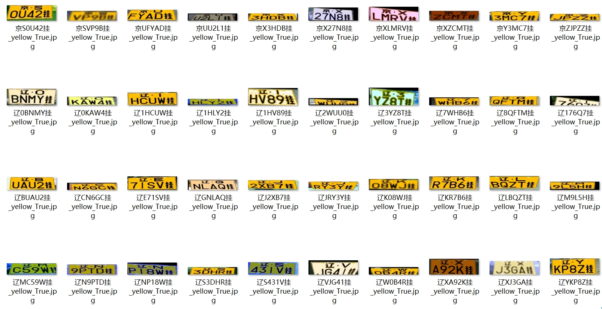
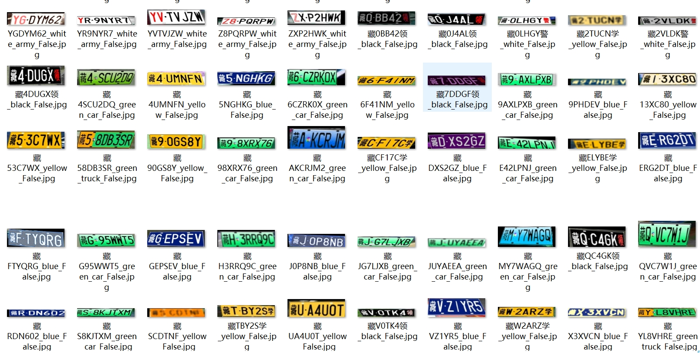

# OCR-车牌数据集制作+识别

## 数据集制作
正常项目中生成的车牌不真实、泛用性很差，因为车牌检测模型不会很准确的只检测出车牌，还会带有一些边缘部位的干扰。

本项目生成完车牌之后，会加入各种数据增强手段增加车牌的泛用性，并且采用透射变换，从车牌到一张真实RGB图像上，然后再稍微随机增加或减少四个点的横纵坐标，再反向投射变换回来，生成的车牌可用性强。

## 数据集生成效果（有各种干扰加入）：
**双层车牌结果**

**单层车牌结果**

