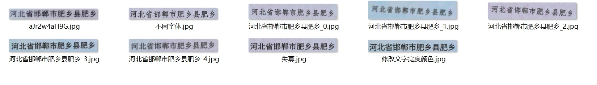

# OCR-身份证数据生成

## 介绍
身份证数据为敏感数据，市面上不会出现可供模型训练的身份证真实数据，本项目旨在生成类似的身份证数据，以供OCR模型在身份证识别上效果更加理想。

## 生成效果（有各种干扰加入）：

## 初次实验（没有考虑任何的扰动加入）：

效果极差。除了能识别自己数据集里的图片，完全识别不了身份证中的图片。

原因：数据生成的时候，没有加入干扰。都是一种字体，甚至都在一个位置。

观察别人制作的生成数据集：有模糊、倾斜、颜色变化

## 第一次改进：

加入各种干扰。多字体，多种模糊方式，整体图像模糊+字体噪声，字体随机倾斜（角度较小），上面生成这些图像，初始模型只能识别最初的那张图像。一点泛化性没有。不管是换位置，换字体，加干扰，只要变了，就识别不出来。

准备设计各种不同的生成方案，混合为一个数据集。如更改字体，更改字体粗细，字体颜色，字体倾斜角度，字体干扰等。由于之前已经把各种准备工作（字典，背景，字体）做完了，只需要运行一下代码即可。

结果：稍有改善，但是存在两个很严重的问题，

颜色问题，身份证的颜色有两种，一种蓝色油墨，一种黑色油墨，，蓝色油墨的字输入到模型中，模型很容易忽略，或者错检。

数字宽度问题，生成的数据集中身份证号的长度仅为18位，因此当测试时，输入15位10位等低位数字，网络完全识别不了，输入高位数据效果也不太号。模型的泛化能力只在16-19维的字效果好一些。

## 第二次改进：

解决方案：

1.针对各种带有蓝色油墨的模块，加入了三种不同蓝色的生成数据。

2.针对数字模块，随机生成1-23维的数字进行数据补充。

效果大幅度改善：

然而还存在一些问题，如2日识别为28。实验了更多的数据之后发现模型的泛化能力还达不到使用标准。

其中较为严重的一个问题在于，生成的字体所处图片的位置会影响其识别。

如下所示：同一串数字，截取的大小不同，导致模型识别的效果也不同，虽然大多数识别正确，但是也会有个别的位移导致识别错误

# 第三次改进

1.生成时不再将字体距离边框位置设置的相同，进行不同的边框位置设定.基本上没有问题了，但是还有个别的数字识别错误。

# 总结：

##      制作OCR数据集时，先加入真实数据，在此基础上加入词泛化性的生成数据集（各种各样的字都会出现较多次），再加入一些特殊的生成数据集（仿照场景生成专用的：如水表、身份证）。 生成时随机性参照下图。

\Personal-project-summary\OCR-IDcard\img\zj.jpeg)

# 最终效果对比（与DBNET检测模块一起）

##      纯针对性生成结果（180W）

# 不包含针对性生成的数据集（360W，10W，100W，21W）

# 所有的数据集（针对性生成的（180W）加上360W，10W，100W，21W）

# 最终去掉之前生成的不正规数据，使用生成策略生成50W左右针对性身份证识别数据，加上360，10，100，21（所有均识别正确，泛化性和正确性都有保障）

