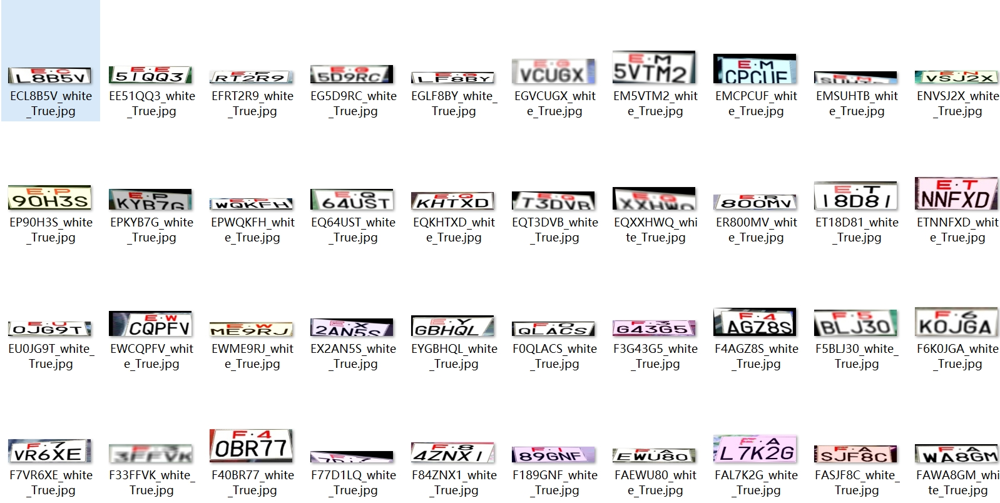
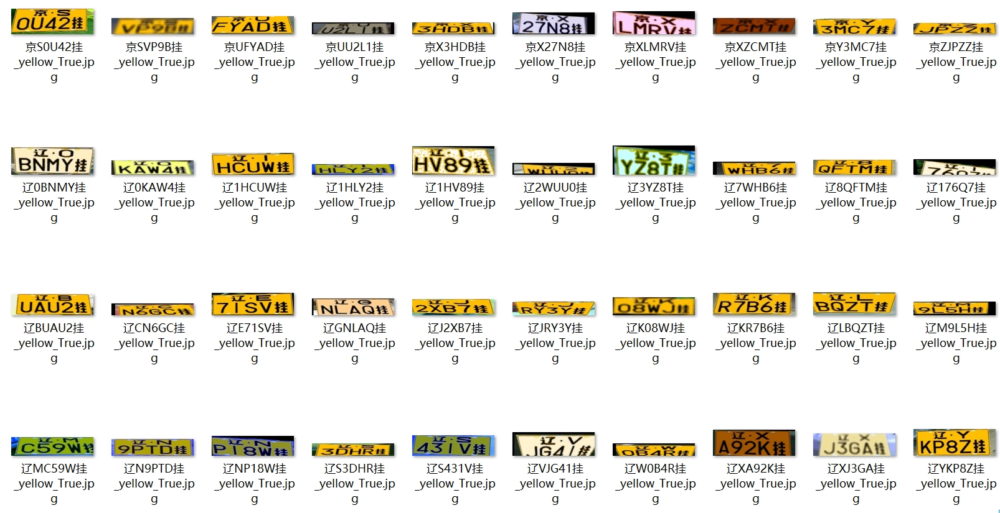
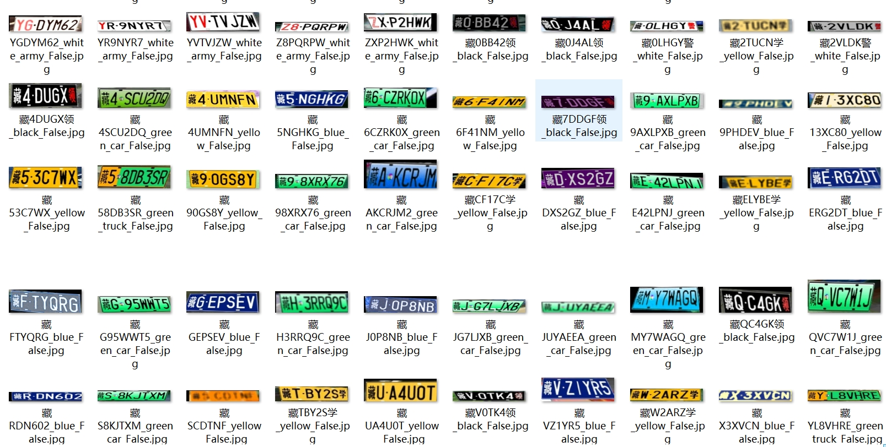

# OCR-车牌数据集制作+识别

## 数据集制作
正常项目中生成的车牌不真实、泛用性很差，因为车牌检测模型不会很准确的只检测出车牌，还会带有一些边缘部位的干扰。

本项目生成完车牌之后，会加入各种数据增强手段增加车牌的泛用性，并且采用透射变换，从车牌到一张真实RGB图像上，然后再稍微随机增加或减少四个点的横纵坐标，再反向投射变换回来，生成的车牌可用性强。

解决的相关问题：

1.车牌数据集的不足。（各种车牌，双层，军车等各种颜色样式车牌）

2.双层车牌的识别解决方案。

## 车牌数据生成方法：

1.生成一张车牌数据：

2.随机拿一张图片：并将上图给映射到图片中（透射变换）

3.更改四个车牌坐标点的位置，并且再投射变换回来。

## 数据集生成效果（有各种干扰加入）：过程中的一些方法：
**双层车牌结果**

**单层车牌结果**

## 双车牌检测方法：

在送入RNN层之前将特征进行一次分层，例如最终CNN提取的特征为2x512，将其上下分层然后转换为1x1024，最终就可以识别出双层车牌。

最终实现的时候还训练了一个分类算法，可以自动区分单层车牌和双层车牌，然后送入不同的CRNN中进行识别。

最终效果：

京E_A5331

陕A06725D

