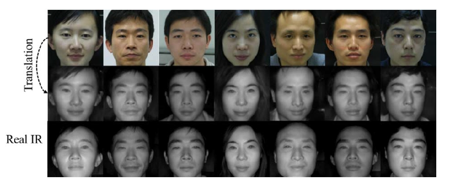
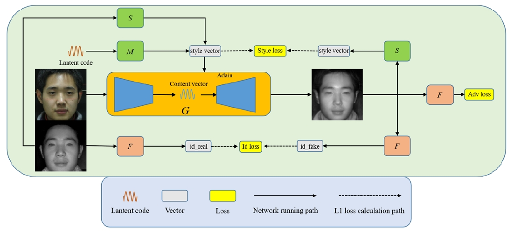
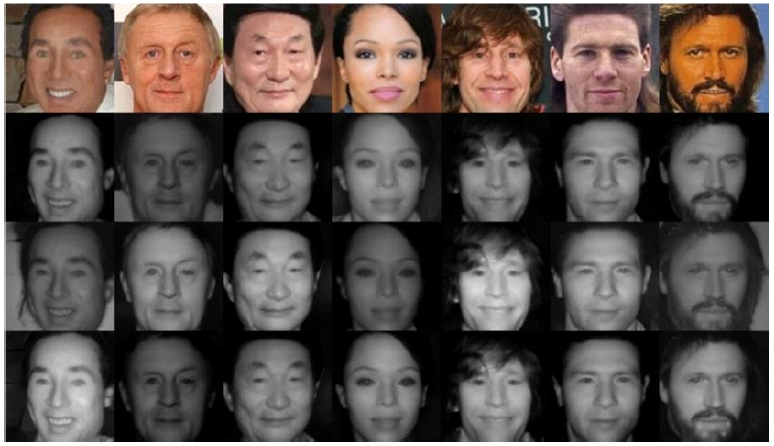

# One-way multimodal Image-to-Image Translation for Heterogeneous Face Recognition
针对的是公共安全领域的一个关键问题：异构人脸识别（HFR）。由于异构数据的稀缺性和显著的领域差异，HFR 一直是一个挑战。提出了一种名为单向多模态图像到图像翻译（OMIT）的新方法专注于解决异构人脸识别中异构数据不足的问题。当前方法或因数据有限而表现不佳，或在人脸识别过程中需要额外的域转换时间。
#### 生成结果

## 创新点
OMIT 提出了单向多模态转换机制将大规模的可见光（VIS）人脸数据转换成对应的近红外（NIR）人脸数据。这种单向转换对于异构数据集的创建是一种有效的策略，尤其是在可用的 NIR 数据较少的情况下。

为了确保在转换过程中保留人脸的身份信息，OMIT 引入了身份保持损失函数。这确保了生成的 NIR 图像在保留原始 VIS 图像的关键身份特征的同时，也符合 NIR 领域的特性。

通过生成高质量的 NIR 图像，OMIT 能够有效地提升异构人脸识别系统的性能。

#### 网络结构图

## 实验结果
OMIT可以使用RGB图像生成不同光照下的多模态IR图像。

#### OMIT的多模态生成结果

