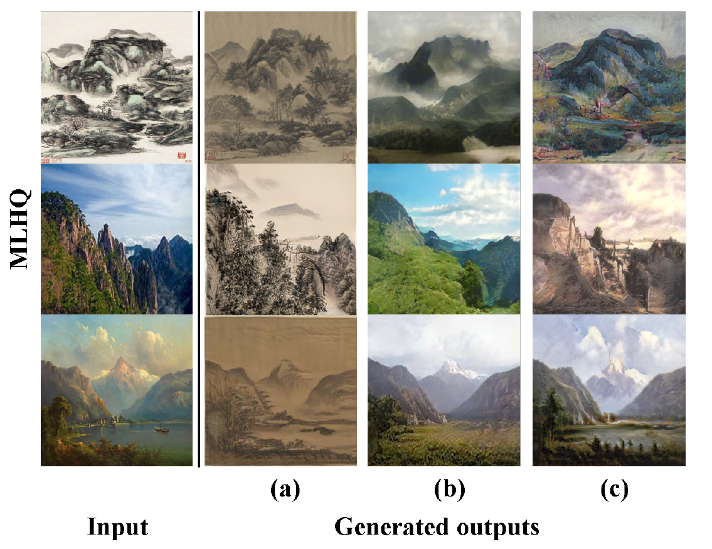
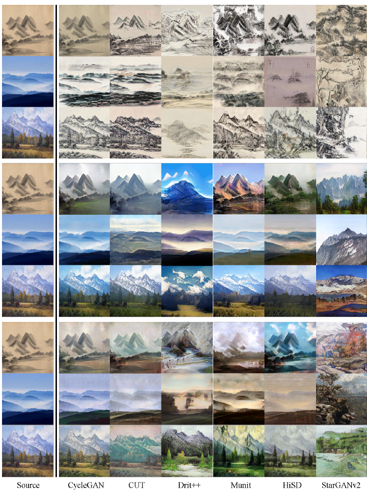
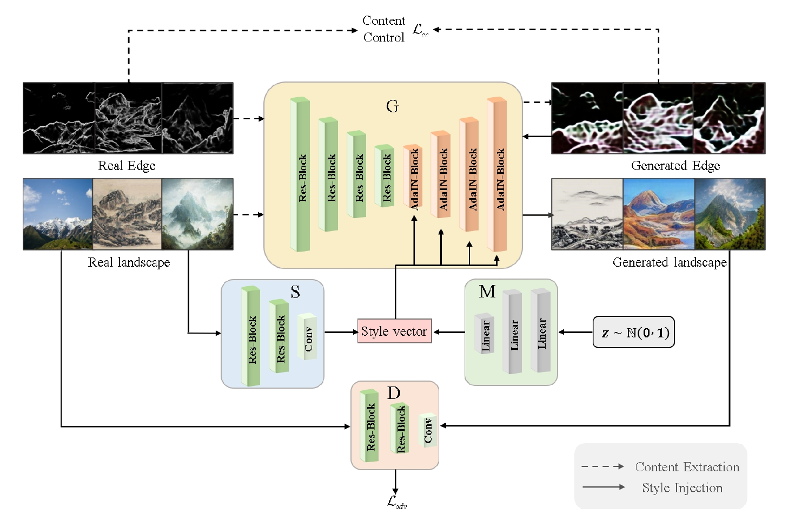
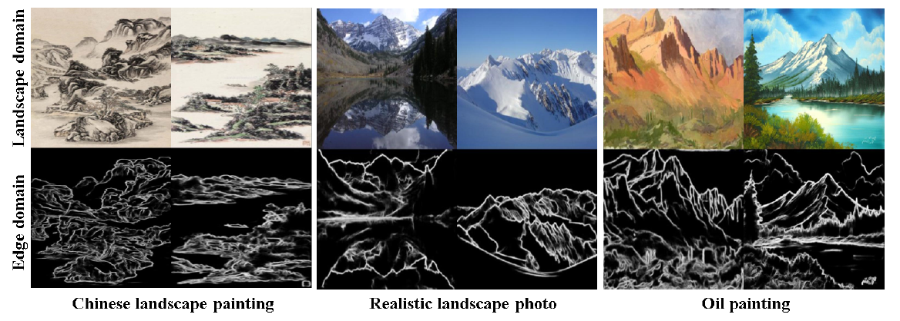

# Two-stage multi-domain generative adversarial network for landscape image translation

## 介绍
TMGAN 是一种创新方法，旨在解决中国山水画、真实景观照片和油画这三种不同艺术领域之间图像到图像的转换任务。
#### TMGAN效果

## 整体研究思路：
### 1. 收集数据集：
  调研发现并没有现成的多域多模态类型的风景迁移数据集。首先确定了多个域为：现实风景域；山水画（中国）；油画（外国）。然后分别收集各个风景域的公开数据集，例如：[山水画数据集](https://github.com/alicex2020/Chinese-Landscape-Painting-Dataset),油画数据集以及现实风景数据集几乎没有高质量的公开数据集，因此个人从[flick](https://www.flickr.com/)上收集了大量的图片，并且经过自己筛选后，每个域留下了3000张左右的图片（按照之前做的各种图像转换实验的经验，3000是一个合理的数字）。最终制作了“MLHQ”，即多域景观高质量数据集。它是为了支持多域风景图像翻译研究而特别设计的。
### 2. 经典图像转换模型在风景迁移任务上的表现
收集现有的流行最广泛的几个网络模型，在MLHQ上进行训练，并进行实际效果对比。
#### 转换效果图

  可以发现，之前的图像到图像翻译方法存在的缺陷主要包括：
    
  1.内容保留问题：传统方法在进行风格转换时往往难以有效地保留原图像的内容。尤其是在保持全局内容，比如山脉的结构和轮廓等方面，这些方法往往会丢失一些重要的内容信息​​。
  
  2.风格表达控制不足：这些方法在精确控制风格转换方面也存在不足，导致风格的传递和表达不够理想。这主要是由于缺乏对转换过程中内容和风格之间平衡的有效控制​​。  
  
### 3. 设计
针对上述的问题设计了TMGAN，其结构图如下：
#### TMGAN网络结构

  主要针对性改动如下：
  
  1.改进的内容保留：通过采用两阶段方法（内容提取和风格注入），TMGAN能更有效地保留原始图像的内容。加入的边缘图作为额外的内容指导输入，帮助网络获得更多的全局内容信息，并增强对生成内容的控制​​，从而在风格转换的过程中更好地保留图像的结构和细节​。

  2.两阶段的生成方式实际上使用一个GAN网络完成，利用Adain可以改变生成域的特性，将边缘图作为一个特殊的域空间。在第一阶段时，引导模型生成对应的边缘图像，在第二阶段的时候，引导模型将第一阶段生成的边缘图像转化到对应的域空间（现实风景、山水画、油画），完成图像翻译。这样做的好处为，从其他域到边缘域的生成时，完全会去掉本身所在的域的信息，将隐式的内容风格分离变为了显式的强制性的分离。在第二阶段的时候，网络可以将全部注意力放在如何进行风格注入。

  3.综合性能提升：相较于现有的图像到图像翻译模型，TMGAN在质量和量化实验中表现出更好的综合性能。它在多域或多模态翻译任务中极大地提高了生成模型的可扩展性和生成图像的多样性。

具体实施过程中，如果希望将转换过程变为两阶段的，需要每个域的图片都有对应的边缘图像，经过调研之后，本文选用[HED网络](https://github.com/s9xie/hed)模型来进行边缘提取操作。部分提取结果如下：

### 4.实验对比数据
