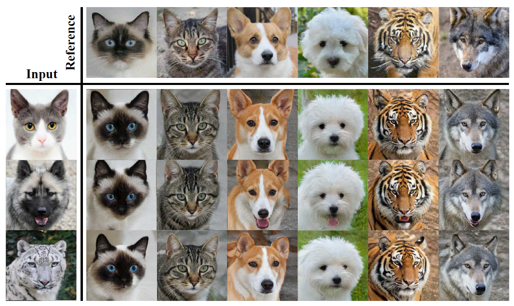
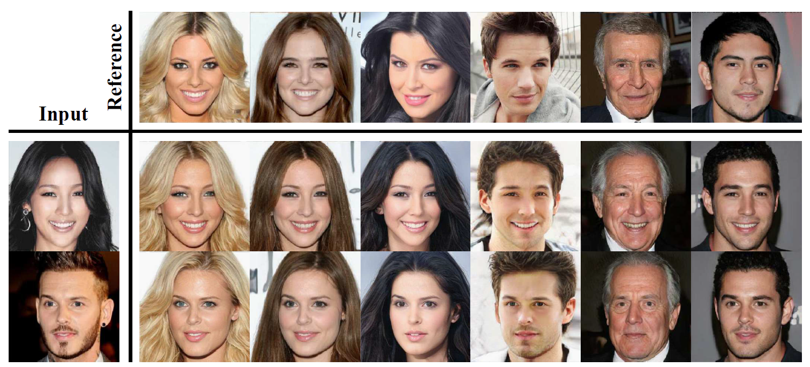
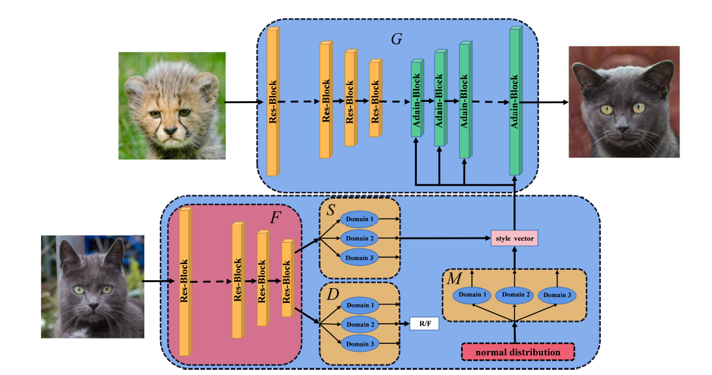
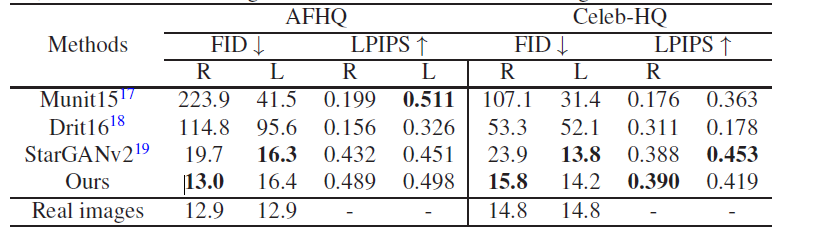

# SUNIT: Multimodal Unsupervised Image-to-Image Translation with Shared Encoder
介绍了一种名为Sunit的多模态无监督图像到图像翻译方法，旨在解决图像从源域到目标域的转换任务。
#### AFHQ数据集上的结果图

#### Celeb_HQ数据集上的结果图

## 创新点
现有的多模态图像翻译网络架构无法准确地转换指定图像的风格，且它们通常需要一个额外的深层编码器网络来提取图像风格代码。
Sunit是一种带有共享编码器的多模态无监督图像到图像翻译方法。核心改动有两点：
  
  1.提出了一种更紧凑、有效的多模态图像翻译架构，使用共享编码器来提取鉴别器和风格编码器的信息，从而简化了多模态图像翻译网络的结构​​。
  
  2.设计了风格编码器的新训练策略，使其专注于将图像映射到相应的风格空间​​。

#### 网络结构图

在Sunit中，共享编码器结合了鉴别器的信息来帮助提取风格。这意味着风格编码器可以利用鉴别器在辨识真实与生成图像方面的能力，从而更有效地捕捉和编码风格信息。这种方法提高了风格转换的准确性和质量​​。共享编码器的使用还与风格编码器的新训练策略相结合，使风格编码器专注于风格重建损失而不是跟随生成器训练。这种策略使得风格编码器在训练过程中目标更明确，能更有效地学习如何将图像映射到相应的风格空间

## 实验结果
从指标对比可以很明显的看出，共享编码器的设计极大的提高了参考引导生成的质量。

#### FID和LPIPS的对比结果

从对比图可以看到Sunit的风格迁移更加准确，包含一些细节的传递。
#### AFHQ对比图

#### Celeb-HQ对比图

#### 与现在的SOTA模型Starganv2进一步对比

